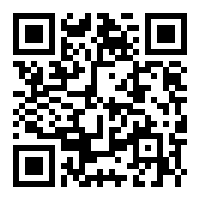

  

<h1 align="center">QR Code Generator</h1>

## 📚 The Storybook 

  

## ✨ Features

-   📦 Editable QR Code creation..
-   🛡 API for automation.
-   ⚙️ Advanced QR Code types.

## Prerequisites 🛠️

Before you begin, ensure you have met the following requirements:

Make sure you have Node.js and npm installed.

  1. Project should be titled qrcode.

  2.  Run:
  <pre> cd qrcode </pre>
  <pre> browser-sync start --server --directory files "**/*" </pre>
  Application runs from localhost [Browsersync] Access URLs:
 ----------------------------
 Local: http://localhost:3000
 ----------------------------
    UI: http://localhost:3001
 ----------------------------

  3. Copy and paste content of code file and folders into the project folder

     ## OR 👇🏻👇🏼👇🏽👇🏾👇🏿

Clone or Download the repository using:
    <pre>git clone https://github.com/Dorcastunmise/qrcode-generator.git </pre>

## Tools needed to carry out THE STORYBOOK successfully 🛠️
1. Package managers: NPM, Yarn.

2. API source : <a href="https://goqr.me/api/">QR code generator </a>

## Let's Contribute 👍
Step 1 - Fork this repository.
Step 2 - Clone the repository to your local machine.
Step 3 - Resolve the bugs, mentions provided in the Issues section of the repository. Also add a description of what changes you have done.
Step 4 - Add the changes to your repository.
Step 5 - Create a PULL Request. And that's all.
NOTE - Please start the filename with the platform name on which the problem was solved. For example, if you are submitting JavaScript file syntax problem from qrcode then mention filename as (qrcode) qrcodeandsyntax.js.

## What you can contribute in this repo? 👊
You can add your own competitive programming solutions.
There are various topics like Functionality, Modal aspect of qrcode etc.
You can contribute in them
You can contribute some Learning Resources in the READme.md File.
You can modify previous solutions if you feel like your solution has better Time or Space complexity.
Let's Contribute 😃#

## Keywords 🤌
QRcode App Javascript

## Contact 👋 

If you want to contact me you can reach me at :
LinkedIn:<a href="https://www.linkedin.com/in/alimi-oluwatunmise-563915225">@Oluwatunmise</a>

